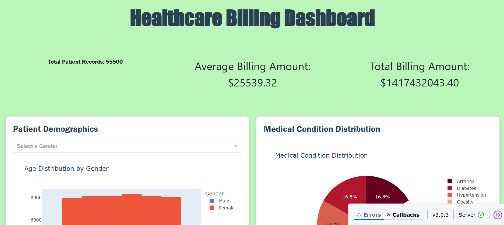
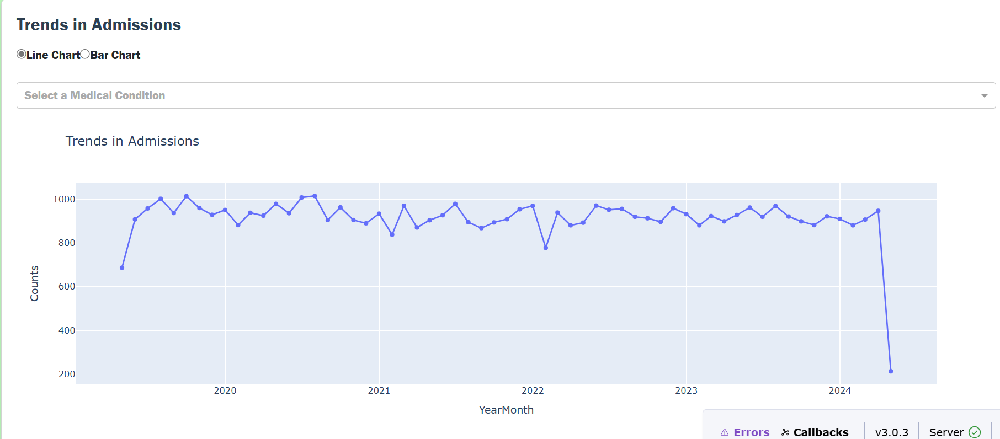

# Healthcare Billing Dashboard
This project is a web-based dashboard built with [Dash](https://dash.plotly.com/) and [Plotly](https://plotly.com/), designed to visualize healthcare billing data. It provides insights into patient demographics, medical conditions, insurance provider comparisons, billing distributions, and admission trends.
## Features
- **Patient Demographics**: Visualize age distribution by gender.
- **Medical Condition Distribution**: Analyze the distribution of medical conditions.
- **Insurance Provider Comparison**: Compare billing amounts across insurance providers.
- **Billing Amount Distribution**: Explore billing amounts using an interactive slider.
- **Admission Trends**: View trends in patient admissions over time with line or bar charts.
## Project Structure
```
.
├── app.py               # Main application file
├── Pipfile              # Pipenv dependencies
├── Pipfile.lock         # Locked dependencies
├── assets/
│   ├── healthcare.csv   # Dataset used in the application
│   ├── style.css        # Custom CSS styles
│   ├── style.css.map    # CSS source map
│   ├── style.scss       # SCSS source file
│   └── dashboard-snapshot.png # Snapshot of the application
```
## Installation
1. Clone the repository:
   ```bash
   git clone https://github.com/KayDD1/dash_by_plotly
   cd PLOTLYBYDASH
   ```
2. Install dependencies using Pipenv:
   ```bash
   pipenv install
   ```
3. Activate the virtual environment:
   ```bash
   pipenv shell
   ```
4. Run the application:
   ```bash
   python app.py
   ```
5. Open your browser and navigate to `http://127.0.0.1:8050/` to view the dashboard.
## Application Snapshot



## License
This project is licensed under the MIT License. See the [LICENSE](LICENSE) file for details.